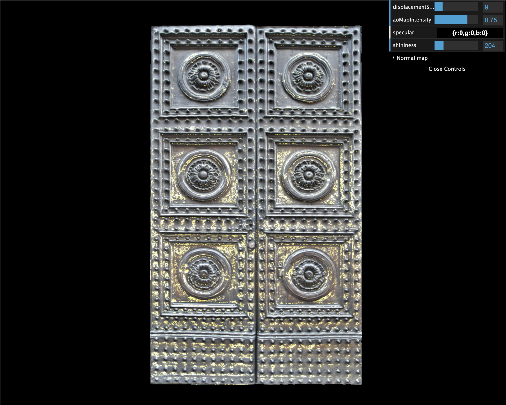

# Three.js texture experiment

This is a small experiment with three.js and textures.
It offers interactive controls to change the parameters of a plane, demonstrating effects of texture mapping, such as normal mapping, specular mapping and so on.

 
 

	

 <a href="https://leandrosq.github.io/js-threejs-texture/">
 		Live demo here
	</a>

## Project

| Name | Description |
| -- | -- |
| Eslint | For linting and semantic analysis |
| Github actions | For CI, building and deploying to github pages |
| Gulp | For tooling and build manager |
| Babel | For transpiling ES6 code |
| Browserify | For bundling and compiling |
| Three.js | For 3D graphics |
| [Texturise.club](http://www.texturise.club/2016/07/italian-rustic-wooden-door-maps.html) | For texture and maps |
| [Redstapler's video](https://www.youtube.com/watch?v=u-7SNWeZKk8&ab_channel=RedStapler) | For inspiration |
